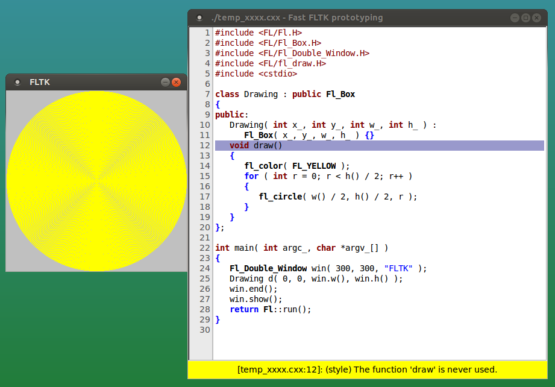

# FLTK Fast Prototyping Demo
`v0.2: 2018/01/20`

A simple *proof of concept* of an idea how to "rapid prototype"
a single source `FLTK` application using `FLTK` itself as an IDE.

Opens an editor widget, where you can type a `FLTK` source code,
which is **live compiled and executed** during typing. In case of
compiler errors, the first error is displayed in a box below
the edit field and the source line highlighted.

Also a style check command is executed (default: `cppcheck`), after
compilation succeeded and the first style error is displayed in
the box below.

**Features:**

- `FLTK` keywords are syntax highlighted additionaly to cxx keywords.
- Text size can be changed rapidly with `Ctrl`-mousewheel up/down
- Right mouse popup with clipboard options
- Save current code as template that is used to start a new 'project'
- Layout (size, position, colors, font size,..) is saved on exit

**The envisioned use cases are:**

- `FLTK` novice makes first steps with `FLTK` writing some simple test programs
- `FLTK` advanced user wants to rapidly code the basic outline of a new idea
- Tutor live edits `FLTK` program and has immediate feedback for audience

**The envisioned work procedure is:**

- Have `FLTK` installed systemwide or have a global `fltk_fast_proto.prefs` config file
  where the location of `fltk-config` is specified
- Start up a terminal
- Create some working directory and change into it
- Fire up `fast_proto` and live create your `FLTK` program

**Tested on Linux only.**

Made compilable for Windows (using mingw) too, but not tested
(probably will need additional work).

[GitHub tarball download](https://github.com/wcout/FLTrator/archive/master.zip)

---
