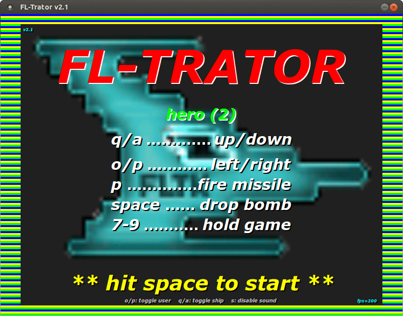
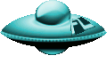
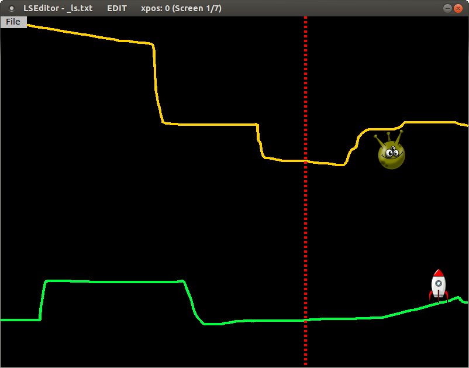
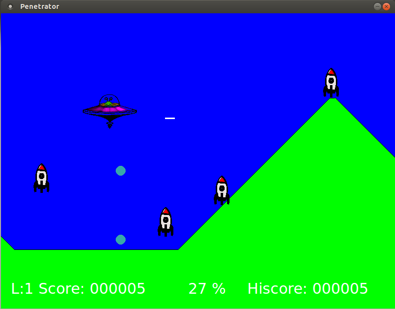

21/12/2016

Welcome to FLTrator - FLTK arcade game!
=======================================

Introduction
------------

**FLTrator** is a *VERY* retro style game in which you steer a spaceship through a scrolling
landscape with hostile rockets and other obstacles.

It is loosely inspired by a game called '[Penetrator](https://en.wikipedia.org/wiki/Penetrator_\(video_game\))', which was an arcade game from 1983(!)
on the [Sinclair ZX Spectrum](https://en.wikipedia.org/wiki/ZX_Spectrum). (I always found it a nearly perfect made game both from a
technical and playability point of view, considering it had to fit in only 48k of ram).

That's also the reason for the name: it is written using **FLTK** - the
**F**ast-**L**ight-**T**oolkit, so **FLT** + Pene**trator** => **FLTrator**.

To be honest, I started out only to make a tiny experiment if something like that
could possibly be done with nothing else but FLTK [1] - and as  the first results were
positive, I got hooked and tried to make something playable out of it.

But of course it could be endlessly improved and expanded,... which I think will likely
not happen ever. [2]

What's become of it now is: __10 different levels__ of play - no mission or things like that -
the goal beeing only to end level 10.

Levels can be edited with a supplied level editor though! So you can create other, perhaps
more exciting levels, than the ones defined by me.

[1] Why FLTK? I know there are so many game writing libraries out there for
      C, C++, Python, Javascript and even HTML5 nowadays - I had a look at some of these -
      and came back to FLTK for it's simplicity and long term steady API. I like
      to start a project from scratch and with no dependencies.

[2] Note: Actually I could not resist to polish up things a little, so now - nearly a year
      later - I have added background planes, gradient drawing, explosions and title animations.
      But this was also only for proof of concept ;-). Nothing more to come.

---

The game
--------

You control a spaceship with the keyboard that is moving over a right to left scrolling
terrain. But the terrain is changing fast and there are some enimies in it, that won't
let you pass so easy...

Touching any part of the landscape with the ship is always deadly. Touching objects mostly.

The first aspect of the game is the landscape. Landscapes have a ground level and
optionally a "sky" (or ceiling). This offers some ways to make them "interesting" 
by creating steep hills, tight gaps or tunnels,..

The other part are the objects, that can be put into the landscape:

### Rockets 
   - Can be shot at with missiles and bombs.
   - Always destroy ship at collision.
   - Get more dangerous with each level.

### Radars 
   - Are not particularly dangerous, but are obstacles and score well.
   - Can be shot at with missiles (but need 3 hits!) and bombs.
   - Always destroy ship at collision.
   - Trigger rocket launch if not destroyed early.

### Drops 
   - Are nasty.
   - Can be "evaporated" with missiles.
   - Only destroy ship when they hit it fully, otherwise do no harm, and are just deflected.
   - Get more dangerous with each level.

### Badies 
   - Are also nasty as they block the way.
   - Can be attacked with missiles, but it needs up to 5 hits to succeed.
   - Are always deadly when touched.

### Phasers  
   - Emit deadly vertical beams at random intervals (hint: they turn red when fully charged).
   - Can be destroyed with missiles and bombs.

### Clouds 
   - Do no harm, except that the ship gets invisible when passing through.
   - Can not be destroyed.

The combination of landscape and objects makes it possible to create some
challenging tracks.

And most important of course is the:

### Spaceship  

   - Can fire missiles horizontally.
   - Can drop bombs  vertically.
   - Can lag speed for some time, or speed up, which can be very usefull.

The game is controlled by keyboard only, just like in the old days..

See all options with

  `fltrator --help` or find the navigation/control keys in the title menu.

---

The landscape editor
--------------------

You can edit any of the supplied landscapes or create new landscapes and
freely position objects in it.

See all options with

   `fltrator-landscape --help` or press `F1` key for help.

If you have created some interesting new landscapes I would be glad to see them!

---

Licence
-------

The game code is licensed under *GPL 3* or later.

FLTrator uses images from:

   [Clipartlord](http://www.clipartlord.com)

   [Pixabay](http://www.pixabay.com)

that are Public Domain or are licensed under `Creative Commons 3.0`.
The images are modified slightly (colors, sizes, details), but keep their
licence.

See `ATTRIBUTION` file for files with Creative Commons licence.

FLTrator also uses sound files (`.wav`) from:

   [Soundbible](http://www.soundbible.com)

   [Wavsource](http://www.wavsource.com)

   [OpenGameArt](http://www.opengameart.org)

that are licenced under `Attribution 3.0 licence` or are Public Domain.
The sounds are modified slightly (duration, format), but keep their licence.

See `ATTRIBUTION` file for files with Creative Commons licence.

---

Resume
------

To answer the initial question, wheater it's possible to write a game just
using FLTK: **yes, it's possible**, but probably only if it's such a simple type
as this one is and if you have already some experience with FLTK's principles.

FLTK has a very uncomplicated, yet powerful event handling and drawing system, a lot
of useful image handling methods - and it is really **FAST**.

Also most real work had nothing to do with the gameplay (this was finished
quite early - except the necessary performance tuning), but writing the
framework "around" the game and designing the levels.

   

*To illustrate: the first fully functional developer version (see screenshot) was finished
within one week and had about 1000 LOC. The final version now has over 8000 LOC and does
essentially the same, but much more refined.*

Initially I had much trouble to get the game running decently on Windows mostly
because of timer and sound woes.

Sound generally is an issue, that probably will want you to use a dedicated library
soon. I have put some effort into sticking with 'aplay' on Linux and an
"aplay-emulation" for WIN32, which after all do the job quite well. I even
managed to play background sound with it.

But in the first place I had much fun writing it and learned a lot during
this time (probably also, that I'm not of the game writer type :)).

So there it is, it's done - and become quite cute, I think.

Although I won't probably make huge changes to the game, if you have any easy to
implement ideas for improvement or find bugs, please report them to me.

Have fun with FLTrator!

**Curious**: Can you finish _all ten_ levels?

---

Links
-----

   [SourceForge Download](https://sourceforge.net/projects/fltrator/files/?source=navbar)

   [YouTube video v2.3 (Level 1)](https://www.youtube.com/watch?v=q1tK40ZBG7E)

   [Older version: YouTube video level 4](https://www.youtube.com/watch?v=dZa2rYsGHHQ)

   [Older version: YouTube video level 6](https://www.youtube.com/watch?v=PoPRpiJ5oAs)

   [FLTK](http://www.fltk.org/)

   [Play my Javascript port](jstest/pene/index.html)

---

   [Read BUILD instructions](build.html)

