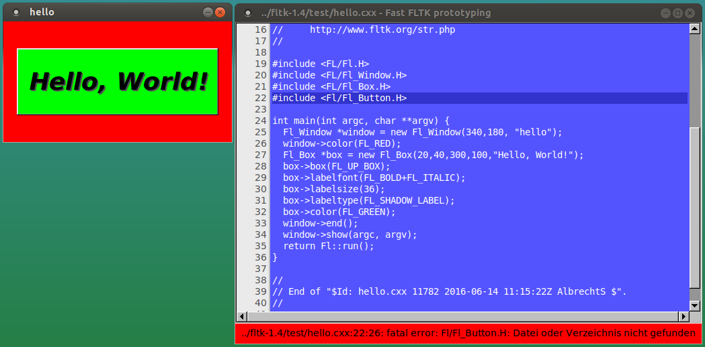

wcout΄s GitHub page
===================

My [FLTK](http://www.fltk.org/) stuff:
--------------------------------------

[FLTrator](fltrator.html)

A retro style scrolling arcade game made solely with FLTK.

[GitHub source](https://github.com/wcout/FLTrator)

---

[Animated GIF display](animgif.html)

Extend FLTK with animated GIF functionality.

[GitHub source](https://github.com/wcout/fltk-gif-animation)

---

[Fast FLTK prototyping demo](fast_fltk_proto.html)

Write short FLTK programs with immediate feedback.

[GitHub source](https://github.com/wcout/fast-fltk-proto)

---

[FLTK starfield simulation demo](starfield.html)

Show off FLTK's performance and simplicity with a nice to watch demo.

[GitHub source](https://github.com/wcout/fltk-starfield-simulation)
