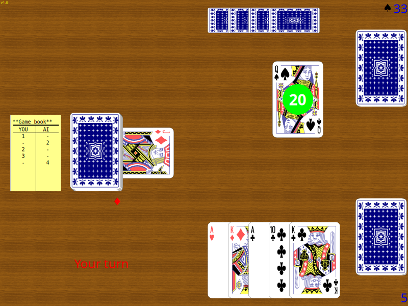

# FLTK Schnapsen

*An implementation of the popular (Austrian) card game "Schnapsen"*

`v1.0  08/12/2025`

Requires `FLTK 1.4` or above.

Play cards against the computer and try to avoid a "bummerl" ;)

This program tries to offer a decent opponent, though in v1.0 it still has
plenty of room for improvemnet. The goal is to make it as good as any experienced
human player.

It features a resizable screen (fullscreen possible), configurable card decks (with SVG
cards) and table background (image), a score board and offers a English or German interface.

[GitHub tarball download](https://github.com/wcout/fltk-schnapsen/archive/master.zip)

---
