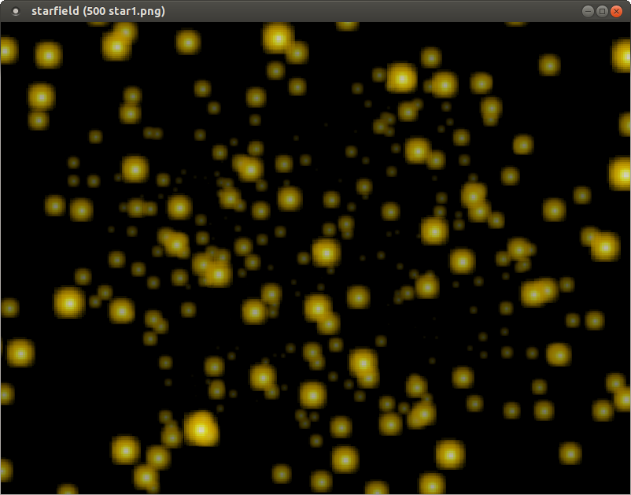

# FLTK Starfield Simulation Demo
`v1.0: 2017/01/22`

##Introduction

This tiny program shows off `FLTK`'s simple concepts
combined with powerful drawing methods very well,
resulting in straightforward coding and good performance.

If the program looks yet complex on the first view, this is
only because of the different options it can handle, which
inevitably blow up the code a little.

---
##History (cited from comment in source file)

I translated and enhanced a program written in
*SmallBasic* language (*SmallBasic* by *ChrisWS*)
to `C++` and `FLTK`.

I found this code about 2009 "in the web", transcoded
it and have improved it slowly over the years, then
forgot about it for some more years and now (2017)
have found it again and decided to make it public.

As there is no explicit claim for non free code in
the original source, I "assume" it can be modified
and redistributed freely.

Should this assumption be wrong, please mail me
and I will remove it from public access.

This translated code can be used and modified freely
without any restrictions **in the assumption the original
code is free too**.

The original source can be found under this link:

   [SmallBasic Star_field.bas source](http://smallbasic.sourceforge.net/?q=node/833)

---

##Description

This program simulates parallactic movement through a star field.
'Stars' can be of any number and can also be images. Also speed and
colors can be adjusted, which  gives some nice scenaries.

Check the supplied `example*.sh` scripts to see the possible arguments.

Test out the performance: call it with e.g. **1000 stars**. On my not so new system this
uses just **7% cpu**! 10000 stars: 29% cpu!

**Tested on Linux only.**
(But should work on Windows too)

[GitHub tarball download](https://github.com/wcout/fast-fltk-proto/archive/master.zip)

---
