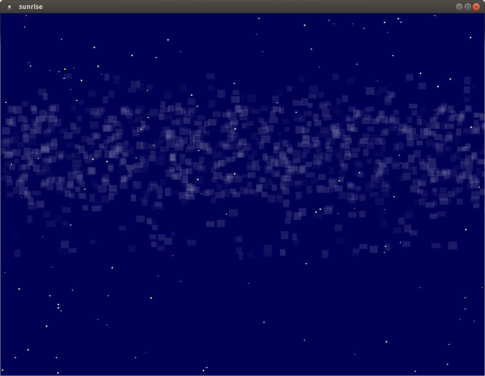
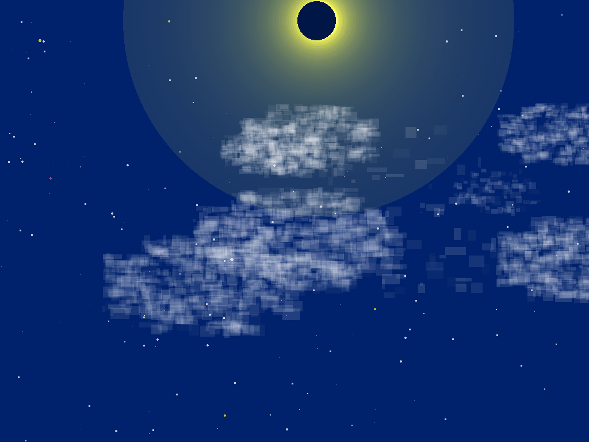

# FLTK Sunrise demo
`v1.0: 2017/03/05`

*“A non-scientific but rather artistic astronomical demo
of sunrise, stars, milky way and sparks - coded in the
principle of mimimalism and stopped enhancing before it
got messy...”*

I wrote this demo within a few hours, after having been inspired
to it by watching a beautiful sunset recently. I wanted to
experiment with the magic melting of colors involved when night
turns to day and vice versa.

I added a few "details" to it after having finished the outline.
Especially nice I find how the clouds worked out, as hords
of small alpha blocks grouped together in the form of a cloud.

`2017/10/06`

I have added drawing of a moon, that occasionally can eclipse the sun.

[GitHub tarball download](https://github.com/wcout/fltk-sunrise-demo/archive/master.zip)

---
